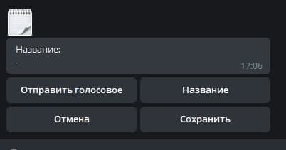
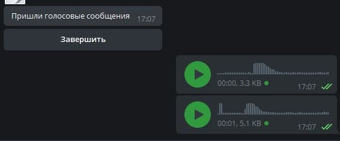
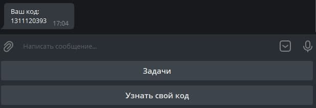
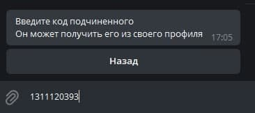
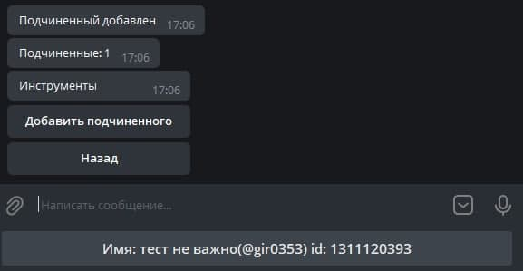
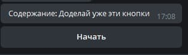
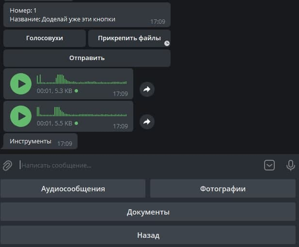
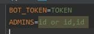

# Бот для распределения задач между подчиненными
### Бот поможет удобно назначать задачи своим подчиненным
#### - Написать название задачи
#### - Прикрепить голосовое сообщение

***
#### Выбор роли

***
#### Добавление подчиненного
##### 1. Начальник должен нажать кнопку добавить подчиненного

##### 2. Подчиненный должен узнать свой уникальный код

##### 3. Начальник должен ввести код подчиненного

##### 4. Появляется подчиненный

***
#### Добавление задачи

***
#### После добавления задачи подчиненному приходит уведомление, и он может приступить к задаче

***
#### Начальник также узнает о том что подчиненный начал выполнение задачи

***
#### Подчиненный может прослушать голосовые сообщения, прикрепленные к задаче

***
#### К выполняемой работе можно прикреплять файлы(аудио, фотографии, документы) перед отправлением выполненной работы

***
#### После выполнения работы, работодателю приходит уведомление, и он может просмотреть прикрепленные файлы

***
## Установка
#### 1. Создайте файл .env в директории где лежит README.md
####    впишите туда токен от бота
####    впишите туда телеграмм id юзеров через запятую, чтобы сделать их админами

#### 2. Укажите в переменных среды ключ подключения к базе данных(иначе автоматически создаться локальная база данных)
#### 3. Запустите файл app.py
##### из консоли (python(3) путь до проекта\app.py)